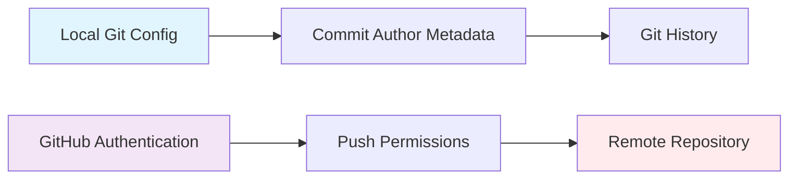

# 🔒 Git Repository Security Guide

## **IMPORTANT: Your Repository Is Secure!**

The git account switching in this dev container is **LOCAL ONLY**. It does **NOT** give anyone permission to push to your GitHub repositories.

## 🔐 **How Git Access Actually Works**

### 1. **Two-Layer Security System**



**Layer 1: Local Git Configuration (What we change)**
```bash
git config --global user.email "ricksue69@gmail.com"
# → Only affects who appears as commit author
# → Does NOT affect push permissions
```

**Layer 2: GitHub Authentication (What protects you)**
```bash
gh auth login  # SSH key, Personal Access Token, or GitHub CLI
# → Required for ANY push operation
# → Enforced by GitHub servers
# → Separate from git config
```

### 2. **What This Container Actually Changes**

✅ **Safe Operations (Local Only)**
- Sets commit author name and email
- Configures local git behavior
- Creates aliases for convenience

❌ **Impossible Operations (Server Protected)**
- Pushing without GitHub authentication
- Bypassing repository permissions
- Accessing private repositories without credentials

## 🛡️ **Security Scenarios**

### ✅ **Safe Scenario:**
```bash
# Someone clones your repo and runs:
git config user.email "hacker@malicious.com"
git commit -m "My commit"
git push origin main

# Result: PERMISSION DENIED!
# GitHub rejects push without valid authentication
```

### ❌ **Impossible Scenario:**
```bash
# Changing git config to gain access:
git config user.email "ricksue99@gmail.com"
git push origin main

# Result: STILL PERMISSION DENIED!
# GitHub doesn't check git config for authentication
```

## 🎯 **Security Best Practices**

### **Repository Level Security**
1. **Keep repositories private** when possible
2. **Use branch protection rules** for main branches
3. **Require pull requests** for code changes
4. **Limit collaborators** to trusted individuals

### **GitHub Account Security**
1. **Enable 2-Factor Authentication (2FA)**
2. **Use SSH keys** instead of passwords
3. **Rotate Personal Access Tokens** regularly
4. **Monitor authorized applications**

### **Dev Container Security**
1. **Never commit secrets** (API keys, passwords)
2. **Container only configures metadata**, not credentials
3. **GitHub CLI authentication** is user-specific and secure
4. **Each developer authenticates** with their own GitHub account

## 📊 **What Actually Gets Configured**

```bash
# ✅ What we set (safe metadata):
git config --global user.name "tasticp_"
git config --global user.email "ricksue69@gmail.com"

# ❌ What we DON'T set (security protection):
# GitHub authentication tokens
# SSH private keys
# Repository permissions
# Access credentials
```

## 🔍 **Verification Steps**

### **Check Your Current Git Identity:**
```bash
git-who
# Shows: Current git configuration (local only)
```

### **Check GitHub Authentication:**
```bash
gh auth status
# Shows: Current GitHub authentication status
```

### **Test Repository Access:**
```bash
git push origin main
# Will fail without proper GitHub authentication
```

## ⚡ **Quick Security Checklist**

- [ ] Repository is private or access is limited
- [ ] 2FA enabled on GitHub account
- [ ] SSH keys or tokens are secure
- [ ] Branch protection rules are active
- [ ] Personal access tokens have minimal scopes
- [ ] Dev container contains no secrets

## 🎉 **Bottom Line**

**Your repositories are completely secure!** 

The dev container only changes commit authorship metadata (local), while GitHub enforces authentication and permissions (server-side). Someone would need your actual GitHub credentials to push to your repositories.

---

*For any security concerns, review GitHub's official security documentation and enable all recommended security features.*